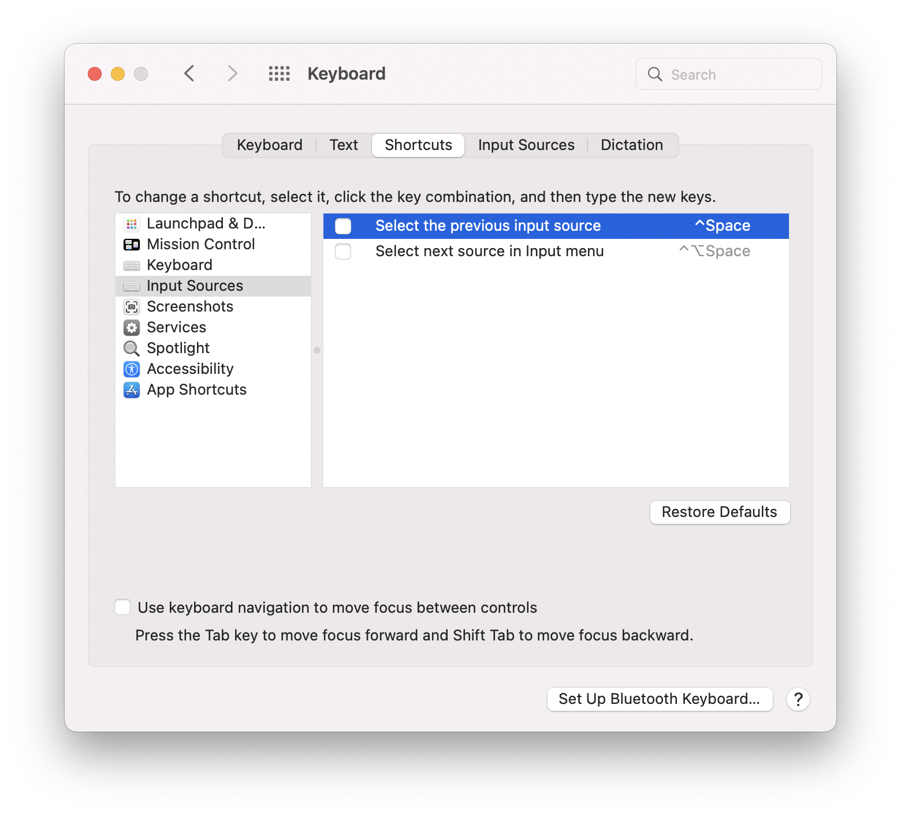

# im
Change your input method from anywhere but a Shortcuts




Inspired by `https://github.com/laishulu/macism`

## Install

```bash
mint install ytyubox/im
```

## Usage

Check `im --help`

```text
USAGE: im [--toggle] [--list] [--last] [--list-id] [--list-alfred] [<id>] [--set-last <set-last>]

ARGUMENTS:
  <id>                    The ID to select

OPTIONS:
  --toggle                toggle last input method by im
  --list                  show list
  --last                  show last id for toggle
  --list-id               show id list
  --list-alfred           show list as Alfred Format
  -s, --set-last <set-last>
                          Set the name to toggle
  --version               Show the version.
  -h, --help              Show help information.

```

## Feature 😎

1. Able to toggle from last input method! `im --toggle`
2. Set input method by keyword! `im pinyin`
3. Even can set input by shorter keyword `im spin` for ShuangPin!
